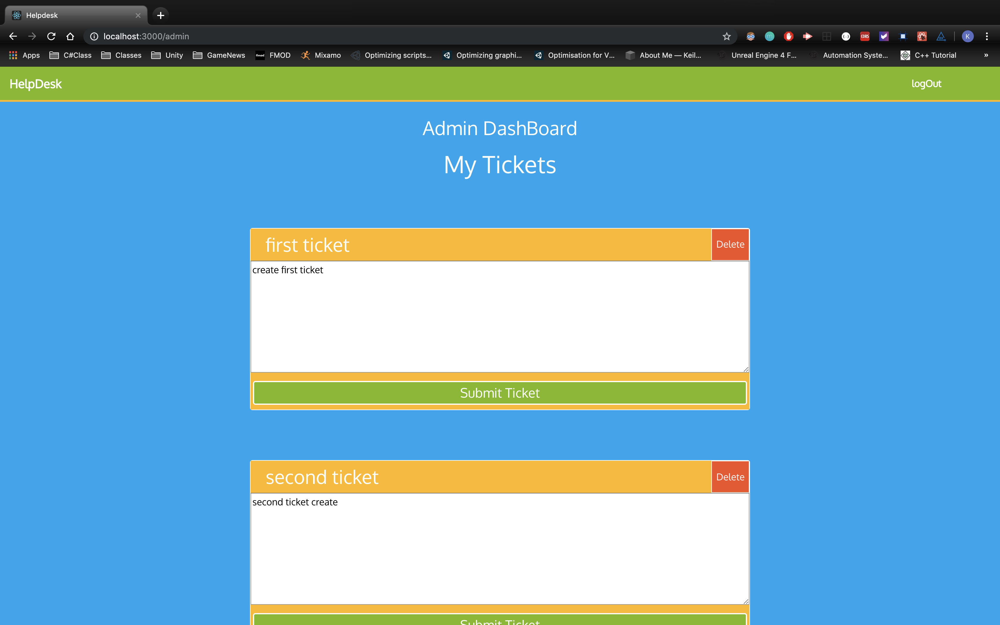
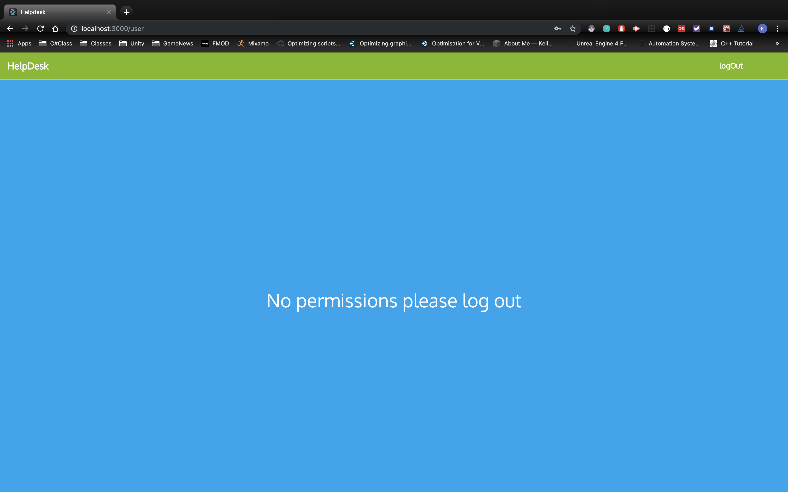
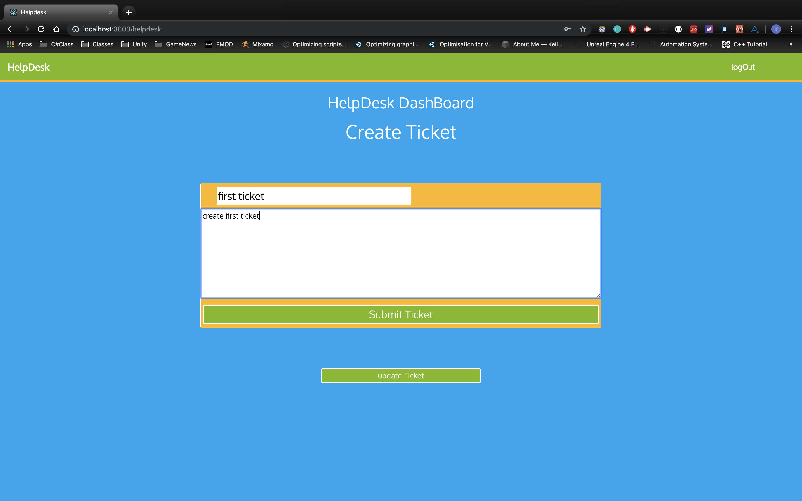
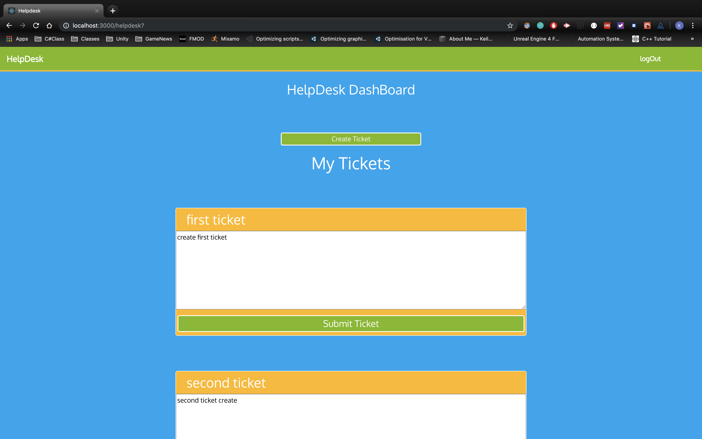
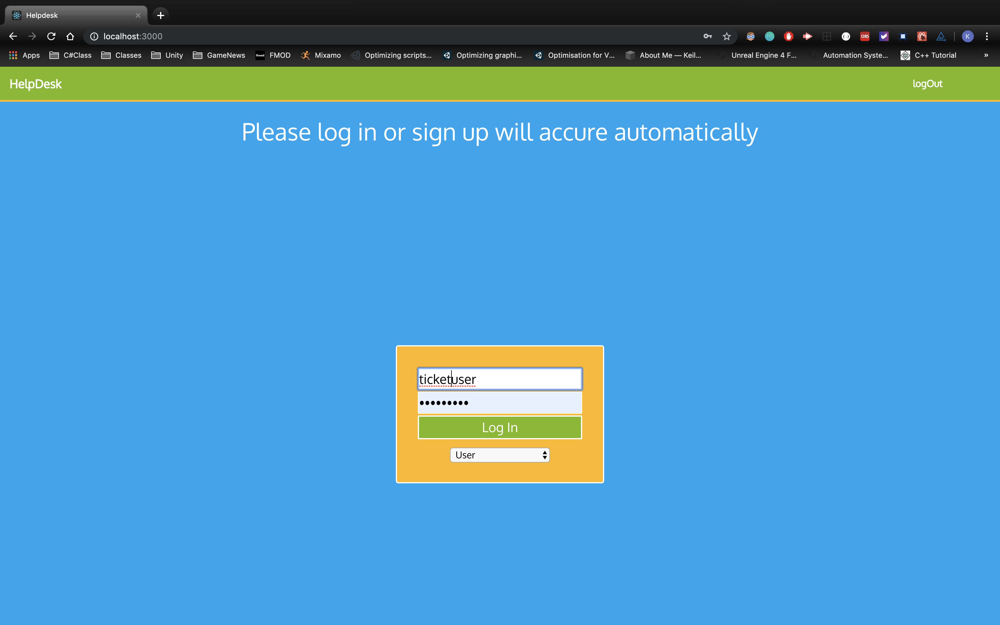

# `HELP DESK`
This is a quick app made as a part of a coding interview

This project was bootstrapped with [Create React App](https://github.com/facebook/create-react-app).
### screenshot

### 'ERROR FIXES'
if you recieve 500 Internal Server Error
please navigate to [helpdesk_server/models] and attach the schema database to the the project by typing in the commands within 
the models folder
1. mysql -u root -p
2. source schema.sql
3. exit

now if you run it should be fixed!
-------------------------------------
if you receive Failed to load resource: net::ERR_CERT_AUTHORITY_INVALID
please connect to a secured wifi or on the webpage allow for unauthorized services

what is happening here is the https is not reading your browser or connection as secured 

now if you run it should be fixed!
-------------------------------------

## Prerequisits

Please run below commands

This application expects you to hace dotnet which can be found[https://dotnet.microsoft.com/download]
Additionally npm tools installed for command line which can be found
[https://nodejs.org/en/]

### `npm start`

Runs the app in the development mode. 
Open [http://localhost:3000](http://localhost:3000) to view it in the browser.

The page will reload if you make edits. 
You will also see any lint errors in the console.

### `dotnet run`
Runs the app in the development mode. 
Open [https://localhost:5001] to view it in the browser.
In the project directory, you can run:

### `instructions`
1. Open helpdeskAPI and type in the command line dotnet run  
to start you back end server.

2. Open m_helpdesk and type in the command line npm start to start your react server 

3. Now both of your servers should be running on 
backend: [https://localhost:5001]
frontend: [http://localhost:3000]

4. Once here feel free to create or log into an account by typing in your username or password and picking a role from the dropdown menu.

5. Once login is pressed it will automatically check for your username and hashedpassword within the database. if you are found you will be logged in with your information. 
otherwise you will be creating a new account and populate your data from there

### `working routes/pages`
1./

2./user

3./helpdesk

4./admin

### `user stories completed`
User Story: As a User, I can log in and out of the system.

User Story: As a Helpdesk User, I can create a support ticket.

User Story: As a Helpdesk User, I can update my support tickets.

User Story: As a Helpdesk User, I can view all of my support tickets.

### `user stories still in development`
User Story: As a Helpdesk Team Member, I can view all support tickets. 

User Story: As a Helpdesk Team Member, I can update any support ticket. 

User Story: As a Helpdesk Team Member, I can delete any support ticket.

### `git respositories`
Frontend: [https://github.com/keilaloia/helpDesk]

Backend: [https://github.com/keilaloia/helpdesk_server]